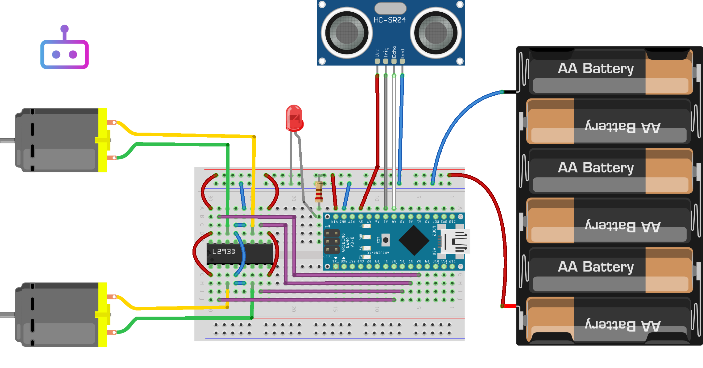

# Robot Obstacle Avoidance

Este projeto apresenta um robô capaz de evitar obstáculos usando sensores e um algoritmo de evasão. O esquema elétrico exibido acima foi gerado utilizando o software Fritzing.

## Vídeo Demonstrativo
<svg xmlns="http://www.w3.org/2000/svg" height="1em" viewBox="0 0 576 512"><!--! Font Awesome Free 6.4.2 by @fontawesome - https://fontawesome.com License - https://fontawesome.com/license (Commercial License) Copyright 2023 Fonticons, Inc. --><path d="M549.655 124.083c-6.281-23.65-24.787-42.276-48.284-48.597C458.781 64 288 64 288 64S117.22 64 74.629 75.486c-23.497 6.322-42.003 24.947-48.284 48.597-11.412 42.867-11.412 132.305-11.412 132.305s0 89.438 11.412 132.305c6.281 23.65 24.787 41.5 48.284 47.821C117.22 448 288 448 288 448s170.78 0 213.371-11.486c23.497-6.321 42.003-24.171 48.284-47.821 11.412-42.867 11.412-132.305 11.412-132.305s0-89.438-11.412-132.305zm-317.51 213.508V175.185l142.739 81.205-142.739 81.201z"/></svg>Confira o vídeo demonstrativo no YouTube para ver o robô em ação:

## Chassi do Robô

🛒 Para construir o robô, você pode adquirir o chassi Arduino no Mercado Livre através deste [link](https://www.conectabit.com.br/MLB-3447161105-rob-tanque-tank-esteira-robotica-evita-obstaculo-chassi-diy-_JM).

## Licença

Este projeto é distribuído sob a licença [MIT](LICENSE), o que significa que você pode usá-lo livremente em seus próprios projetos, desde que mantenha a atribuição apropriada e os termos da licença.

## Como Usar

Fornecer instruções detalhadas sobre como clonar, configurar e executar o projeto aqui.

## Contribuições

Contribuições são bem-vindas! Se você quiser melhorar este projeto, sinta-se à vontade para abrir uma "pull request".

## Autores

- Seu Nome

## Agradecimentos

- Mencionar qualquer pessoa ou recurso que você gostaria de agradecer.
